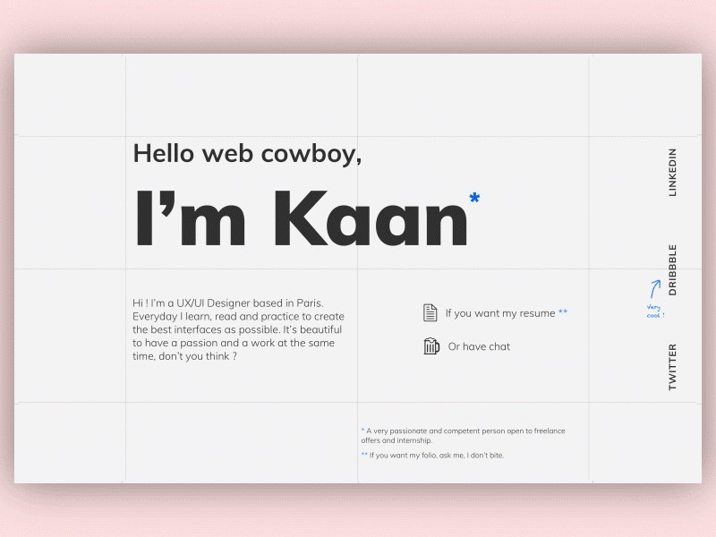
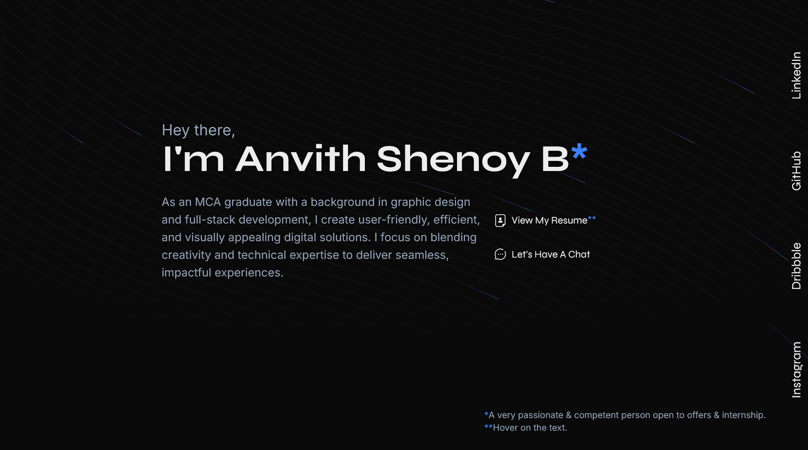

# BoutMe Portfolio Template

Welcome to the BoutMe Portfolio Template! This project is a modern, single-page portfolio website built using **Next.js**, **Tailwind CSS**, and **Framer Motion**. It serves as a highly customizable and interactive platform to showcase personal or professional information.

## Features

- Dynamic animation using Framer Motion.
- Fully responsive layout.
- Easy customization via environment variables.
- SEO-friendly and fast.

## Obtained Design vs Final Design

Here is a comparison of the original design inspiration and the final implemented design:

### Original Design Inspiration



### Final Implemented Design



## How to Use

### Prerequisites

- Node.js (v16 or higher)
- npm or yarn

### Installation

1. Clone the repository:
   ```bash
   git clone <repository-url>
   ```
2. Navigate to the project directory:
   ```bash
   cd bout-me
   ```
3. Install the dependencies:
   ```bash
   npm install
   # or
   yarn install
   ```

### Configuration

All personal data such as links, names, and contact details are dynamically rendered from the `.env` file. This eliminates the need to modify the code for customization.

1. Create a `.env.local` file in the root directory:
   ```bash
   touch .env.local
   ```
2. Add the following variables to the file:

   ```env
   USER_NAME="Your Name"  # Full name of the user

   DESCRIPTION="I'm a totally cool guy who codes and develops a bunch of stuff. And I'm pretty crazy for anime and food. "  # A brief description of professional skills and areas of expertise

   MAILING_ID="example@gmail.com"  # Email address for professional communication

   RESUME_LINK="https://tinyurl.com/i1uwnb/"  # The user's resume is stored on Google Drive and can be accessed publicly via the link

   LINKEDIN_PROFILE="https://linkedin.com/in/your-url/"  # Link to the user's LinkedIn profile for networking and career-related information

   GITHUB_USERNAME="github-user"  # GitHub Profile for showcasing technical projects and contributions

   OTHERS_NAME='["Dribbble", "Instagram"]'  # Platforms for sharing design work and creative content
   OTHERS_LINK='["https://dribbble.com/dribbble/", "https://instagram.com/instagram/"]'  # Direct URLs to these platforms
   ```

### Run the Project

To start the development server:

```bash
npm run dev
# or
yarn dev
```

Open [http://localhost:3000](http://localhost:3000) to view the website in your browser.

### Build for Production

To build the project for production:

```bash
npm run build
# or
yarn build
```

Serve the production build:

```bash
npm start
# or
yarn start
```

## License

This project is licensed under the MIT License. You are free to use, modify, and distribute it for personal or commercial purposes.

---

Feel free to reach out if you have any questions or need assistance!
